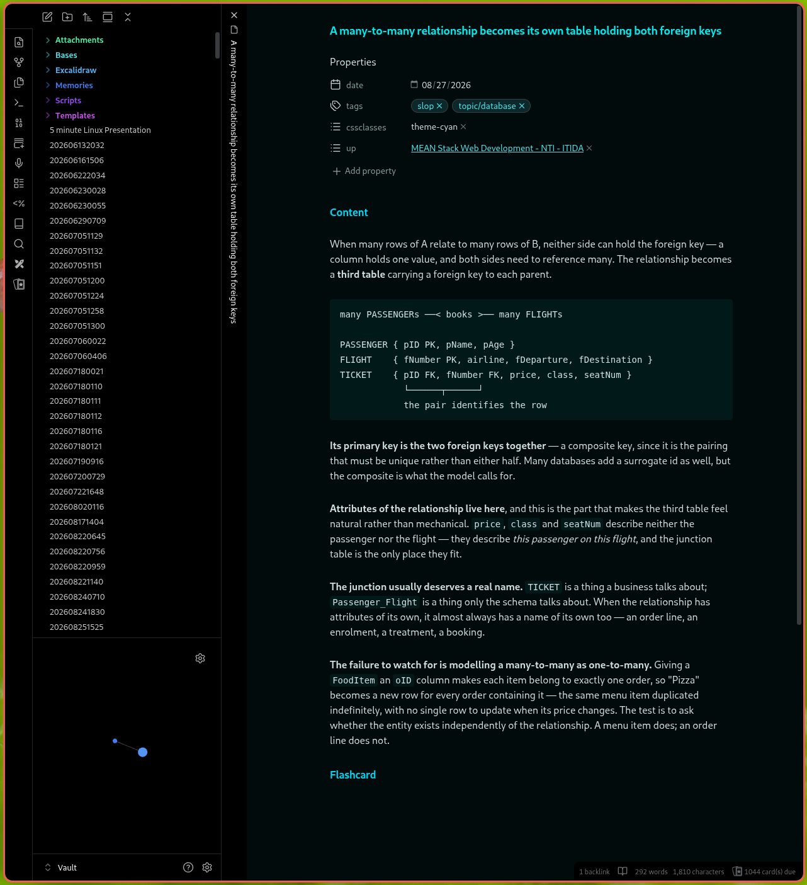

# Obsidian Tiling WM

A CSS snippet that strips Obsidian's window chrome, for people running a tiling window manager. No plugin.



Gone: the titlebar, the close/minimise/maximise buttons, the sidebar collapse arrows, the tab bar, and the per-pane view header. What is left is the note, the sidebars if you want them, and the status bar.

## Why

A tiling window manager already owns window geometry. It decides where the window goes, how big it is, and when it closes — so a titlebar with its own close, minimise and maximise buttons is a second set of controls for something you have already delegated. Worse, it costs a strip of vertical space on every window, permanently, to duplicate a job your keybindings do better.

The same argument extends inward. If you are already driving windows from the keyboard, the tab bar and the sidebar chevrons are mouse affordances for things with perfectly good hotkeys.

## How it came to be

The [usual forum answer](https://forum.obsidian.md/t/how-can-i-completely-hide-the-titlebar-with-the-front-back-buttons-and-window-close-buttons-on-linux/30610) to this question points at a plugin. It does not need one — hiding UI is what CSS is for, and Obsidian loads user snippets with no restrictions on what they can target.

The problem with the thread, and with most snippets you will find for this, is age. It is from 2021, and Obsidian's DOM has moved since. Copied selectors either miss silently or hide the wrong thing, and you cannot tell which from reading the CSS.

So none of the class names here were copied. They were read out of the installed application's own stylesheet:

```bash
# The asar is a plain archive; the class names are in the clear.
ASAR=~/.config/obsidian/obsidian-*.asar        # flatpak: ~/.var/app/md.obsidian.Obsidian/config/obsidian/
strings -n 6 "$ASAR" | grep -oE '\.(titlebar|workspace-tab-header-container|sidebar-toggle-button|view-header|workspace-ribbon|status-bar)[a-z-]*' | sort | uniq -c | sort -rn
```

That is worth knowing because it is also how you **maintain** this. When a future Obsidian version renames something and part of the snippet stops working, re-run that command against the new version and compare, rather than searching the forum again.

Written against **Obsidian 1.13**.

## Install

1. Download `Tiling WM.css`.
2. Drop it in `YourVault/.obsidian/snippets/`.
3. Settings → Appearance → CSS snippets → reload → enable **Tiling WM**.
4. Settings → Appearance → **Window frame style → Hidden**.

Step 4 is not optional-but-nice, it is half the effect, and it is a built-in setting rather than a plugin. With *Native*, your window manager draws the decorations and this snippet only removes Obsidian's inner chrome. With *Hidden*, nothing draws them.

## What you lose, and what replaces it

Everything removed here has a keybinding. That is the premise, not a consolation:

| Removed | Use instead |
| --- | --- |
| Tab bar | `Ctrl+O` quick switcher, `Ctrl+Tab` next tab, `Ctrl+W` close |
| Window buttons | Your WM's own bindings |
| Sidebar chevrons | Command palette → *Toggle left/right sidebar* |
| View header nav | `Ctrl+P` command palette reaches all of it |

**Bind the two sidebar toggles to real keys** in Settings → Hotkeys. They are the one thing that becomes genuinely more awkward, since without the chevrons they are otherwise only reachable through the palette.

## Configuring it

If you have the [Style Settings](https://github.com/mgmeyers/obsidian-style-settings) plugin, three toggles appear under **Tiling WM**:

| Toggle | Default | Effect |
| --- | --- | --- |
| Show the tab bar | off | Brings the tab strip back |
| Hide the left ribbon | off | Removes the vertical icon strip |
| Hide the status bar | off | Removes the bottom bar |

**The toggles add chrome back rather than removing it**, which is deliberate. A toggle that removes something leaves the snippet inert when its plugin is missing or disabled — the wrong failure direction for a snippet whose whole job is removal. As written, the defaults hold with no plugin at all, and Style Settings is purely additive.

Without the plugin, edit the file: each section is numbered and independent, so deleting one has no effect on the others.

## Modifying it

The snippet is a short list of selectors, one per piece of chrome:

| Selector | What it is |
| --- | --- |
| `.titlebar` | The whole top strip, including its drag region |
| `.titlebar-button-container`, `.titlebar-button` | Close, minimise, maximise |
| `.sidebar-toggle-button` | The sidebar collapse chevrons (`.mod-left`, `.mod-right`) |
| `.workspace-tab-header-container` | The tab strip |
| `.view-header`, `.view-header-nav-buttons` | Per-pane header: breadcrumbs, back/forward, pane menu |
| `.workspace-ribbon` | The vertical icon strip on the far left |
| `.status-bar` | The bottom bar |

To hide something not listed, find its selector rather than guessing at it. In Obsidian, `Ctrl+Shift+I` opens devtools; the element picker (`Ctrl+Shift+C`) then names any part of the UI you click. Add it in the same shape as the rules already there:

```css
body:not(.is-mobile) .whatever-you-found {
  display: none !important;
}
```

Two conventions in the file worth keeping:

- **`body:not(.is-mobile)`** on every rule, so a synced vault opened on Obsidian mobile is untouched. Mobile has a different layout and no window chrome to remove.
- **`!important`** throughout. Themes set these properties too, and a snippet that loses a specificity battle fails invisibly.

If you want it to apply on Linux only, Obsidian puts `.mod-linux`, `.mod-windows` and `.mod-macos` on `body` — scope with those.

## Known behaviour

- **Removing `.titlebar` removes the window's drag region.** Correct under a tiling WM; if you also use a floating layout sometimes, you will not be able to drag the window by its top edge.
- **With the tab bar hidden there is no visual indication of open tabs.** The note's inline title tells you where you are; `Ctrl+O` gets you anywhere else.
- **Stacked tabs still render their vertical title strip**, which is a separate element from the tab bar and is left alone deliberately — it is the only way to navigate a stack.

## Licence

MIT — see [LICENSE](LICENSE).
